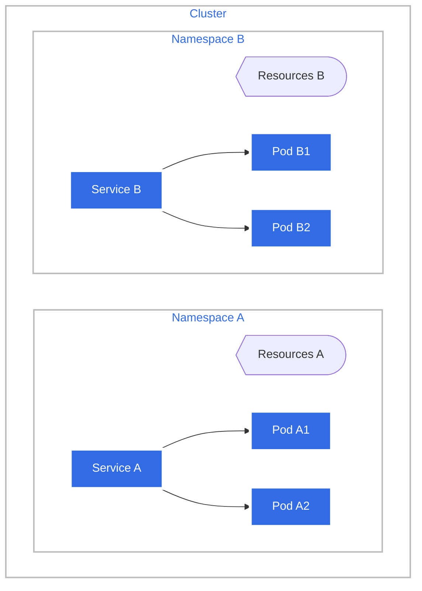
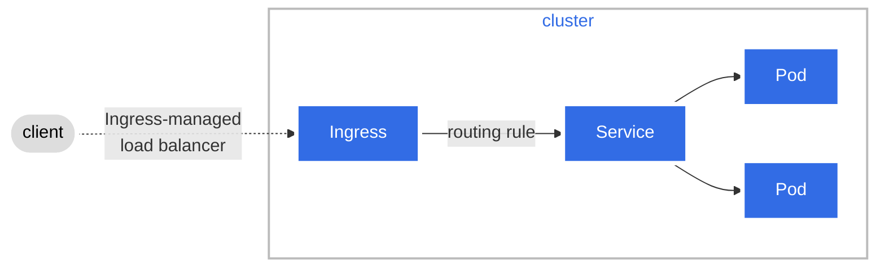

# InceptionOfThings

Orchestration project with Vagrant and Kubernetes 3d &amp; 3s

- [**Part 1 - Vagrant, K3s Server and Agent**](./p1/)
- [**Part 2 - K3s Apps and Ingress**](./p2/)
- [**Part 3 - K3d + Argo CD**](./p3/)

## Notes


### Kubernetes

- [Kubernetes Objects - Declarative management using config files](https://kubernetes.io/docs/tasks/manage-kubernetes-objects/declarative-config/)
- [Kubernetes Glossary](https://kubernetes.io/docs/reference/glossary/?fundamental=true)
- [Kubernetes - Reference](https://kubernetes.io/docs/reference/)

Kubernetes is an open-source container orchestration platform designed to automate the deployment, scaling, and management of containerized applications. It provides a robust framework for running distributed systems resiliently, allowing for load balancing, service discovery, and self-healing capabilities.

```bash
# Create Kubernetes Objects
kubectl apply -f <directory>
```

#### Namespaces

Namespaces are a way to divide cluster resources between multiple users via resource quota. They provide a mechanism for isolating groups of resources within a single cluster. Namespaces are intended for use in environments with many users spread across multiple teams, or projects.



#### K3S

- [K3S - Requirements (hardware,network,...)](https://docs.k3s.io/installation/requirements?os=debian)
- [K3S Install Config Script](https://docs.k3s.io/installation/configuration)
  - [Install Env Vars](https://docs.k3s.io/reference/env-variables)
- [📑 K3S Documentation](https://docs.k3s.io/)
  - [K3S Doc Agent](https://docs.k3s.io/cli/agent)
  - [K3S Doc Server](https://docs.k3s.io/cli/server)

K3S is a lightweight Kubernetes distribution designed for resource-constrained environments and edge computing. It simplifies the deployment and management of Kubernetes clusters by reducing the complexity and resource requirements typically associated with standard Kubernetes installations.

##### K3S - Flannel

Flannel is a virtual network that connects containers across multiple hosts. It is often used as a network fabric for Kubernetes clusters, providing a layer 3 network that enables pods to communicate with each other regardless of the host they are running on.

##### [K3S Architecture](https://docs.k3s.io/architecture/)


#### Ingress

- [📑 Ingress Documentation](https://kubernetes.io/docs/concepts/services-networking/ingress/)

> > [! NOTE]
> > Ingress dev is frozen. New features are being added to [Gateway API](https://kubernetes.io/docs/concepts/services-networking/gateway/).

Ingress is a Kubernetes resource that manages external access to services within a cluster, typically HTTP and HTTPS traffic. It provides a way to define **rules** for routing incoming requests to the appropriate services based on hostnames, paths, or other criteria.

Ingress use an **Ingress Controller** to fulfill the Ingress rules. The Ingress Controller is responsible for processing the Ingress resource and configuring the underlying load balancer or proxy to route the traffic accordingly (like ingress-nginx).



#### K3D

- [K3D Install](https://k3d.io/v5.4.6/#installation)
- [📑 K3D Documentation](https://k3d.io/v5.4.6/#documentation)

K3D is a lightweight wrapper around K3s that allows you to run K3s clusters in Docker containers. It simplifies the process of creating and managing local Kubernetes clusters for development and testing purposes.

```bash
# Create a K3D cluster with 1 server and 2 agents
k3d cluster create mycluster --servers 1 --agents 2
```


### Argo CD

- [Argo CD Install](https://argo-cd.readthedocs.io/en/stable/getting_started/)
- [📑 Argo CD Documentation](https://argo-cd.readthedocs.io)

Argo CD is a declarative, GitOps continuous delivery tool for Kubernetes. It automates the deployment and management of applications by synchronizing the desired state defined in Git repositories with the actual state in the Kubernetes cluster.

```bash
# Install Argo CD in the argocd namespace
kubectl create namespace argocd
kubectl apply -n argocd -f https://raw.githubusercontent.com/argoproj/argo-cd/stable/manifests/install.yaml
```


### Vagrant

- [Vagrant Install](https://developer.hashicorp.com/vagrant/install)
- [📑 Vagrant Documentation](https://developer.hashicorp.com/vagrant/docs)

Vagrant is a tool for building and managing virtualized development environments. It allows developers to create reproducible and portable development environments using simple configuration files. Vagrant can work with various virtualization providers, such as VirtualBox, VMware, and cloud providers like AWS and Azure.

#### Vagrant File

When you use `vagrant up`, Vagrant looks for a file named `Vagrantfile` in the following order:

```bash
[home]/[current_user]/[parent_dir]/[current_directory]/Vagrantfile
[home]/[current_user]/[parent_dir]/Vagrantfile
[home]/[current_user]/Vagrantfile
[home]/Vagrantfile
/Vagrantfile
```

To create a vagrant file, simply create a file named `Vagrantfile` in the desired directory and define your virtual machine configuration using the Vagrant configuration syntax.

```ruby
Vagrant.configure("2") do |config|
  config.vm.box = "ubuntu/bionic64"

  config.vm.network "forwarded_port", guest: 80, host: 8080

  config.vm.provision "shell", inline: <<-SHELL
    apt-get update
    apt-get install -y apache2
  SHELL
end
```

#### Vagrant cmds

```bash
vagrant up
vagrant halt
vagrant destroy
```

```bash
vagrant ssh <vm_name>
```

```bash
# Remove a VM
vagrant destroy <vm_name>
# Force removal
vagrant destroy <vm_name> --force
```

### VirtualBox

[Linux Installation](https://www.virtualbox.org/wiki/Linux_Downloads)

```bash
# List of runnings VMs
VBoxManage list runningvms
```

```bash
# Kernel-based Virtual Machine: conflict resolution - unload KVM modules
sudo modprobe -r kvm_intel kvm
```
