# Bonus - Gitlab, ArgoCD and K3D

```mermaid
---
title: ArgoCD Gitlab Workflow
---
flowchart TD;
  subgraph k3d["Cluster (bonus-cluster)"]
    subgraph nsArgo["Namespace: argocd"]
      direction LR
      argo_pods@{ shape: procs, label: "ArgoCD Pods" }
      argo_svcs@{ shape: procs, label: "ArgoCD Services" }
    end
    subgraph nsDev["Namespace: dev"]
      direction LR
      app_deployment@{ shape: proc, label: "Deployment (wil-playground)" }
      app_svc@{ shape: proc, label: "Service (wil-playground)" }
      app_pod@{ shape: proc, label: "Pod (wil-playground)" }
      app_ingress@{ shape: proc, label: "Ingress (wil-playground)" }
    end
    subgraph nsGitlab["Namespace: gitlab"]
      direction LR
      gitlab_pods@{ shape: procs, label: "GitLab Pods" }
      gitlab_svcs@{ shape: procs, label: "GitLab Services" }
      subgraph git_repo["Git Repo"]
        manifestD@{shape: doc, label: "deployment.yaml"}
        manifestS@{shape: doc, label: "service.yaml"}
        manifestI@{shape: doc, label: "ingress.yaml"}
      end
    end
    IngressController@{ shape: das, label: "📦 Ingress Controller" }
  end

  app_deployment appdeppod@--> app_pod

  git_repo gitargo@-->|"Sync<br>Watches for changes"|argo_pods
  argo_pods argodep@-->|"Applies manifests"|app_deployment
  argo_pods argosvc@-->|"Applies manifests"|app_svc
  argo_pods argoin@-->|"Applies manifests"|app_ingress

  WebClient@{ shape: div-proc, label: "Client" }
  WebClient wclin@-->IngressController
  IngressController ingit@-->|"gitlab.localhost<br>svc: gitlab-webservice-default"| gitlab_svcs
  gitlab_svcs gsvc_gp@-->|8181| gitlab_pods
  IngressController inargo@-->|"argocd.localhost<br>svc: argocd-server"| argo_svcs
  argo_svcs argo_gp@-->|8080| argo_pods
  IngressController inapp@-->|"dev.localhost<br>svc: wil-playground-service"| app_svc
  app_svc app_gp@-->|8888| app_pod

  classDef k8s fill: #326ce5,stroke: #fff,stroke-width:4px,color:#fff;
  classDef cluster fill: #fff,stroke: #bbb,stroke-width:2px,color:#326ce5;
  classDef external fill: #99dfff9f,stroke: #fff,stroke-width:2px,color:#333;
  classDef kub-anim stroke-dasharray: 5,5, stroke-dashoffset: 300, stroke-width: 2, stroke: #617cf8c7, animation: dash 25s linear infinite;
  classDef git-anim stroke-dasharray: 5,5, stroke-dashoffset: 300, stroke-width: 2, stroke: #e0b25cff, animation: dash 25s linear infinite;
  classDef web-anim stroke-dasharray: 5,5, stroke-dashoffset: 300, stroke-width: 2, stroke: #ade05cff, animation: dash 25s linear infinite;

  class argo_pods,argo_svcs,app_deployment,app_pod,app_svc,app_ingress k8s;
  class k3d,nsArgo,nsDev cluster;
  class git_repo external;
  class gitargo git-anim;
  class argodep,argosvc,argoin,appdeppod,appsvcpod kub-anim;
  class wclin,ingit,gsvc_gp,inargo,argo_gp,inapp,app_gp web-anim;
```



## Setup

### 1. Prerequisites & Environment Setup

1.  **Navigate to the scripts directory.**

```bash
cd scripts
```

2.  **Install required tools.**
    This script installs dependencies like Homebrew, Docker, k3d, and kubectl.

```bash
./requirements.sh
```

> [!NOTE]
> You may need to restart your shell (e.g., `source ~/.bashrc`) and run the script again for the changes to take effect.

3.  **Configure hostnames.**
    This script adds `gitlab.localhost`, `argocd.localhost`, and `dev.localhost` to your local hosts file.

```bash
./hosts.sh
```

### 2. Cluster & GitLab Setup

1.  **Create the Kubernetes cluster.**
    This script provisions the `bonus-cluster` using k3d and creates the necessary namespaces.

```bash
./project.sh
```

2.  **Deploy GitLab.**
    This will deploy GitLab Community Edition to the cluster. Please be patient, as this may take some time.

```bash
./gitlab.sh
```

3.  **Configure GitLab.**

- Access GitLab at [http://gitlab.localhost](http://gitlab.localhost) (Outside VM: http://gitlab.localhost:8800).
- Log in with the `root` user and the password provided in the script's output.
- Create a new project named `app`.
- Add your Kubernetes manifests (`deployment.yaml`, `service.yaml`, `ingress.yaml`) from the `app_repo` directory to this new project and commit the files.

> [!TIP]
> You can use the following helper scripts to automate repository creation and SSH key configuration.
>
> ```bash
> # (Optional) Configure SSH access to your GitLab repository
> ./gitlab_ssh.sh
>
> # This script helps create the project and push the manifests
> ./gitlab_app_repo.sh
> ```

### 3. ArgoCD Setup & Application Deployment

1.  **Deploy ArgoCD.**
    This script installs ArgoCD and its command-line tool.

```bash
./argocd.sh
```

2.  **Access the ArgoCD UI.**

- Access ArgoCD at [http://argocd.localhost](http://argocd.localhost) (Outside VM: http://argocd.localhost:8080).
- Log in with the `admin` user and the password provided in the script's output.

3.  **Create the ArgoCD Application.**
    This script configures ArgoCD to monitor your GitLab repository and deploy the application.

```bash
# Run this script after setting up the GitLab repository
./app_cicd.sh
```

### 4. Verify Deployment

Once the application is synced in ArgoCD, you can access it in your browser or curl it at [http://dev.localhost](http://dev.localhost).

```bash
curl http://dev.localhost
```

> [!IMPORTANT]
> If you are accessing the services from the host machine (outside the Vagrant VM), you may need to use specific ports forwarded by the Ingress Controller. For example:
>
> - **GitLab:** `http://gitlab.localhost:8800`
> - **ArgoCD:** `http://argocd.localhost:8080`
> - **Your App:** `http://dev.localhost:8800`

## Useful Commands

```bash
# Get app info
argocd app get wil-playground
```

```bash
# Manual sync
argocd app sync wil-playground --prune --dry-run
```

```bash
# kubectl system info
k get all -n kube-system
# kubectl get all -n <namespace>
```

```bash
# Get cluster in config
kubectl config get-contexts -o name
```

```bash
# Set current namespaces to <ns>
kubectl config set-context --current --namespace=<ns>
```

```bash
# Check ingress resource
kubectl get ingress -A
# Check specific ingress
kubectl describe ingress argocd-ingress -n argocd
```

## K3D

```bash
# Remove cluster
k3d cluster delete <cluster>
```

## Debug

```bash
kubectl logs -n <namespace> <resource>
```

```bash
# Continuous logging of a pod
kubectl logs -n kube-system -f pod/<pod name> > /vagrant/logs/pod_name.log
```

```
kubectl describe <type> <resource> -n <namespace>
```

```bash
# traefik
kubectl logs -n kube-system deploy/traefik
kubectl describe ingress argocd-ingress -n argocd
kubectl get endpoints -n argocd argocd-server -o wide
```
