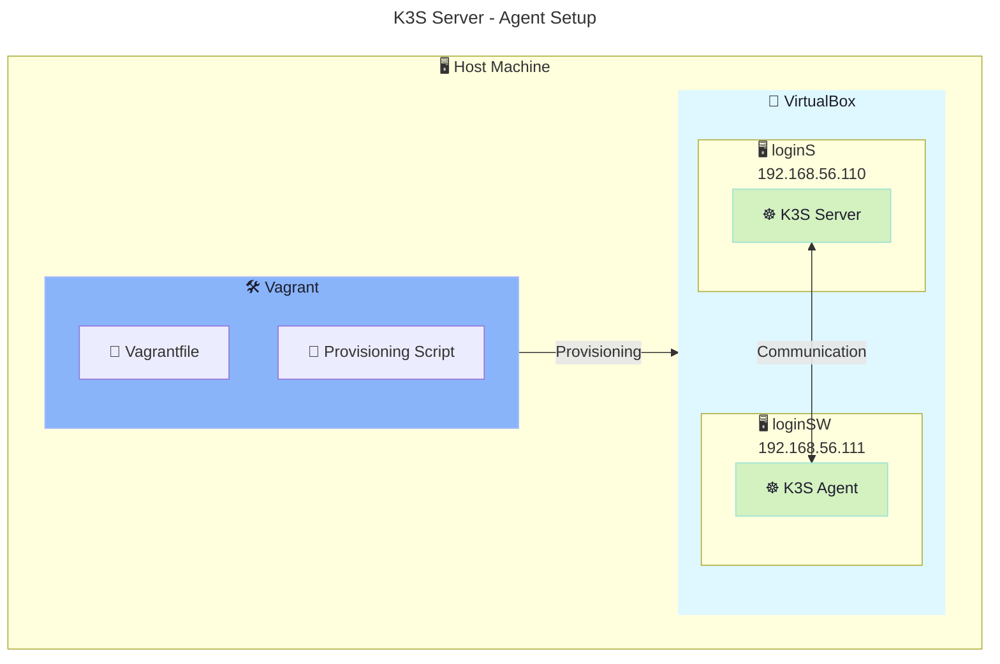

# P1 - Setup K3S Server and Agent

```bash
# Check ip address
ip addr show
## Only show eth1
ip addr show eth1
```



## Networking

`eth1` is the name of the second ethernet network interface. In a Vagrant/VirtualBox setup, it's often used for the private or host-only network that allows VMs to communicate with each other.

- `mtu` (Maximum Transmission Unit) is the size of the largest packet that can be sent over the network interface.
- `enp0s8` is another naming convention for network interfaces in Linux, often used in cloud environments. It serves a similar purpose as `eth1`. It means "Ethernet, PCI bus 0, slot 8".
