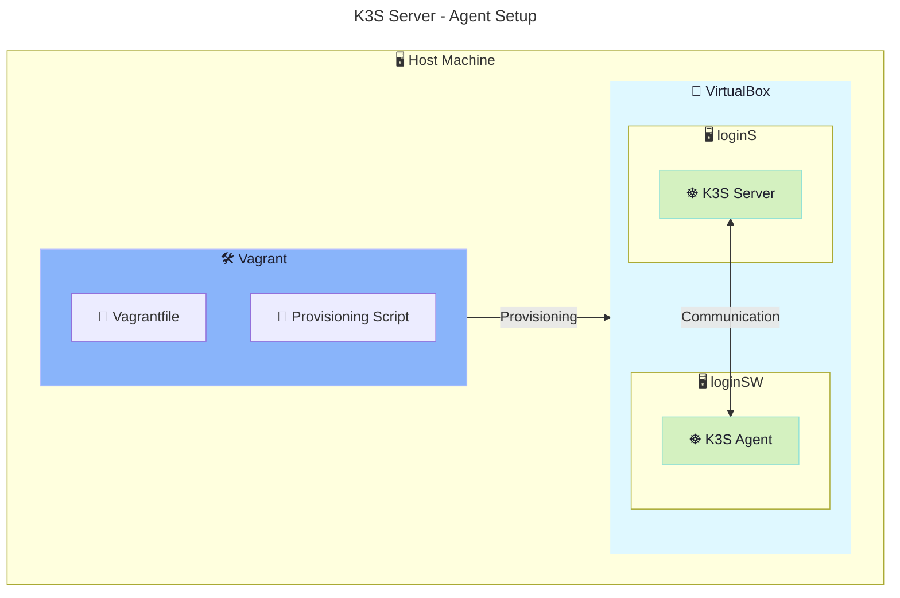

# P1 - Setup K3S Server and Agent

```mermaid
---
title: K3S Server - Agent Setup
config:
  layout: dagre
---
flowchart TD
  subgraph HostMachine["🖥️️️ Host Machine"]
    subgraph Vagrant["🛠️ Vagrant"]
      direction TB
      InvFile["📄 Vagrantfile"]
      PLY["📄 Provisioning Script"]
    end

    subgraph VirtualBox["🥡 VirtualBox"]
      subgraph VMServer["🖥️ loginS"]
        K3S_Server["☸️ K3S Server"]
      end
      subgraph VMWorker["🖥️ loginSW"]
        K3S_Agent["☸️ K3S Agent"]
      end
    end

    Vagrant -->|Provisioning| VirtualBox
    K3S_Server <-->|Communication| K3S_Agent
  end

  classDef files fill: #fadc89ff,color: #616161ff,stroke: #b4befe
  classDef database fill: #7575bdff,color: #ffffffff,stroke: #45475a
  classDef web fill: #88e68dff,color: #575757ff,stroke: #45475a
  classDef vagrant fill: #89b4fa,color: #1e1e2e,stroke: #b4befe
  classDef kubern fill: #a6e3a17c,color: #1e1e2e,stroke: #94e2d5
  classDef vbox fill: #dff8ffff,color: #1e1e2e,stroke: #dff8ffff
  classDef web-anim stroke-dasharray: 9,5, stroke-dashoffset: 900, stroke-width: 2, stroke: #489e5dff, animation: dash 25s linear infinite;
  classDef ansible-anim stroke-dasharray: 5,5, stroke-dashoffset: 300, stroke-width: 2, stroke: #e0b25cff, animation: dash 25s linear infinite;

  class K3S_Server,K3S_Agent kubern
  class Vagrant vagrant
  class VirtualBox vbox
```
