```mermaid
---
title: K3S Instance
config:
  layout: dagre
---
flowchart TD
  subgraph HostMachine["🖥️️️ Host Machine"]
    subgraph Vagrant["🛠️ Vagrant"]
      direction TB
      InvFile["📄 Vagrantfile"]
      PLY["📄 Provisioning Script"]
    end

    subgraph VirtualBox["🥡 VirtualBox"]
      subgraph VMServer["🖥️ loginS <br> 192.168.56.110"]
        Client@{ shape: div-proc, label: "Client" }
        subgraph K3S_Server["☸️ K3S Server<br> (include agent)"]
          subgraph Ingress["🌐 Ingress"]
            IngressController@{ shape: das, label: "📦 Ingress Controller" }
          end
          subgraph K3S_Apps["📦 K3S Apps"]
            App1["📦 App 1"]
            subgraph App2["📦 App 2"]
              replicas1["🔄 Replicas 1"]
              replicas2["🔄 Replicas 2"]
              replicas3["🔄 Replicas 3"]
            end
            App3["📦 App 3"]
          end
        end
      end
    end

    Client cing@-->|host| Ingress
    IngressController iapp1@-->|app1.com| App1
    IngressController iapp2@-->|app2.com| App2
    IngressController iapp3@-->|default| App3

    Vagrant -->|Provisioning| VirtualBox
  end

  classDef files fill: #fadc89ff,color: #616161ff,stroke: #b4befe
  classDef database fill: #7575bdff,color: #ffffffff,stroke: #45475a
  classDef web fill: #88e68dff,color: #575757ff,stroke: #45475a
  classDef vagrant fill: #89b4fa,color: #1e1e2e,stroke: #b4befe
  classDef kubern fill: #fadc89fb,color: #1e1e2e,stroke: #fadc89fb
  classDef vbox fill: #dff8ffff,color: #1e1e2e,stroke: #dff8ffff
  classDef kub-anim stroke-dasharray: 5,5, stroke-dashoffset: 300, stroke-width: 2, stroke: #e0b25cff, animation: dash 25s linear infinite;
  classDef web-anim stroke-dasharray: 5,5, stroke-dashoffset: 300, stroke-width: 2, stroke: #5ce0a2ff, animation: dash 25s linear infinite;

  class cing,iapp1,iapp2,iapp3 web-anim
  class k3sc kub-anim
  class K3S_Server,K3S_Agent kubern
  class Vagrant vagrant
  class VirtualBox vbox
```

# P2 - Kubernetes Apps and Ingress

```bash
# Install VM
vagrant up
# Connect to VM by ssh
vagrant ssh rcutteS
```

```bash
# Kubectl infos
kubectl get all
```

```bash
# Ingress status
kubectl get ingress multi-app-ingress
```

```bash
# Try to reach a host (response with body+headers)
curl -i -H "Host:app1.com" 192.168.56.110
```


