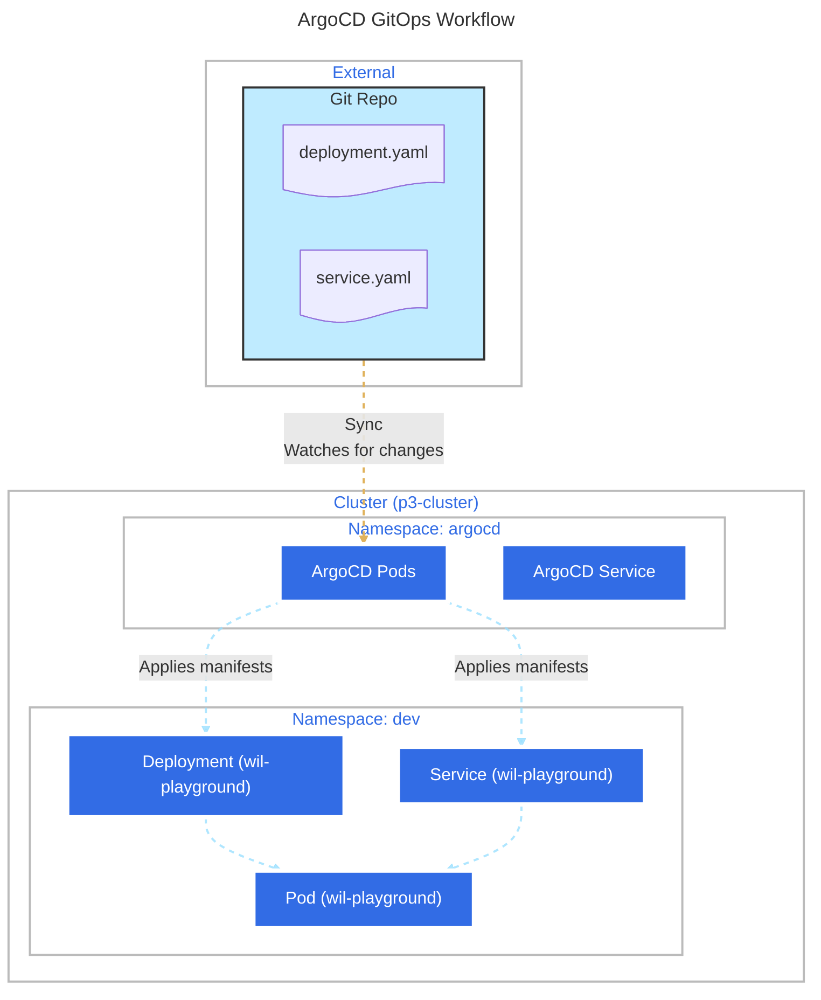

# Part 3 - ArgoCD and K3D



## Setup

```bash
# Setup
./setup_requirement.sh
# Project K3D cluster + ArgoCD namespaces
./setup_project.sh
# Setup ArgoCD App
./argocd_app.sh
# Test gitflow by updating manifests repo version
cd app_repo
./update_version.sh
```

## Usefull commands

```bash
# Get app info
argocd app get wil-playground
```

```bash
# Manual sync
argocd app sync wil-playground --prune --dry-run
```

```bash
# kubectl system info
k get all -n kube-system
# kubectl get all -n <namespace>
```

```bash
# Get cluster in config
kubectl config get-contexts -o name
```

```bash
# Set current namespaces to <ns>
kubectl config set-context --current --namespace=<ns>
```

## K3D

```bash
# Remove cluster
k3d cluster delete <cluster>
```

